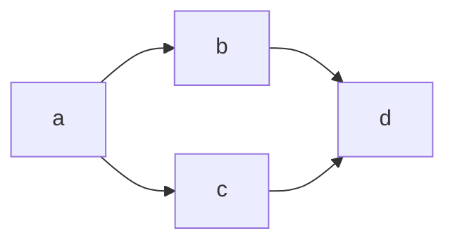

## Concepts

Modify concepts are used throughout and are defined in [reference].

## Get set up

### Onboard

Onboarding consists of two simple steps:

- Login with GitHub or Google
- Create a unique username

After this a personal `team` is created automaticaly for you and adds some `workspaces` with example content to your team.

### Explore example workspaces

`Workspaces` are containers for `connectors`, `reviews` and `jobs`. 

The Mission Control page comes set up with `workspaces` containing example content for common use cases. Click the `Repository` button next to the workspace name to explore. 

### Set up your own workspace 

To create a new `workspace`, click the plus icon on the `workspaces` UI container on the Mission Control page and fill out the form.

Once created, click the `Setup your workspace` button. This will take you to your repository, where you can add a `connector` - a read-write integration to a Git repository. 

### Add a connector 

Click the `Add connector` button to a add a `connector` to a Git repository hosted in Modify, GitHub or Bitbucket.

If you want to start exploring quickly, we recommend you choose a `Modify-hosted connector`, as you can always export your data later to GitHub or Bitbucket.

For connectors to external Git providers - GitHub and Bitbucket - you can use the OAuth-based setup flow to create a connector to a remote repository.

First off, you will need to authenticate with your Git provder, install the Modify app on an organisation (GitHub) or workspace (Bitbucket) you have permissions for and (for GitHub) configure the repositories you want to give Modify access to.

Next, you will need to configure your connector, giving it a name and id, and selecting a remote repository and branch. Now click `Add connector` to create your connector. 

<InfoMessage header="External git provider connectors" content="You'll need accounts and Git repositories set up already to create connectors to GitHub and Bitbucket."/>

Once created, your `connector` will appear in your repository's tree and you can view its directories and files (or `artifacts`, as we call them).

### Branch your workspace

For `Modify Git connectors`, you can branch your `workspace` at any time to work in isolation from your team. This creates branches of all `connectors` and their `artifacts` and adds them to the new `workspace branch`. 

For `external Git provider connectors`, you must create a `workspace branch` before you can edit `artifacts` and directories in your `connector`.

To create a `Workspace branch`, click the `Branch workspace` button in the top right of the repository's header bar. In the modal, select the branch you want to branch from, give your new branch a name and click the `Create branch` button.

Your new branch will now be selected in the repository's breadcrumb and you can get on with collaborating on `artifacts`.

## Create content

Collaborating on artifacts takes place in your repository. 

`Artifacts` are files stored in `connectors` and include markdown and MDX `docs`, yaml `registers`, svg, jpeg and png `images`, and PDFs rendered by jobs. The repository supports real-time collaboration on `docs` and `registers`. 

To share an `artifact` with a `user` who is already a member of your team, copy the url using the icon in the view's header and send it to them. To share an artifact with someone who is not a member of your team, click the `collaborate` button in the repository's header and send an email invite to them.

You can also move between `workspaces`, `workspace branches`, `connectors` and `artifacts` using the breadcrumb in the header bar.

### Configure your layout 

You can configure your repository's layout and views to get the most out of your data. 

Use the view selector dropdown in a view's header to select the view you want - editor, preview or table. In the menu, there are three presets to choose from - live preview, preview and editor. 

You can also select `split view` to add an additional view to your layout. 

### Create markdown docs

To add a markdown `doc`, hover over a directory in your repository's tree, click the plus button and select `New file` in the context menu.

Now enter the file's path (e.g. `my-doc.md`) and click the `Add a file` button.

You can now add content to your doc using GitHub-flavoured markdown.

<InfoMessage header="New to Markdown?" content="Use the editor's cheatsheet to famliarise yourself with the syntax, and its toolbar to add syntax to your docs"/>

#### Add components with MDX

[MDX](https://mdxjs.com/) enables you to embed components inside of markdown `docs` with JSX.

You can use the editor's MDX cheatsheet to learn how the syntax works by clicking the `MDX syntax` button in the editor's header. 

Additionally, clicking the `</>` button next to it, will show a palette will available MDX components.

For more info on MDX syntax, you can also hover over the component name, once added to your editor, and inspect the tooltip.

### Create yaml registers

To add a yaml `register`, hover over a `connector` directory in your repository's tree and click the plus button. Select `New register` in the context menu, provide a `Title` and `id`, and click the `Add a register` button. 

You will now see a `.modify.yaml` file appear in your register directory, which contains your register's configuration data including basic front matter (`Title` and `id`) and its schema.

#### Define a schema

The quickest way to see a schema in action is to choose one of the templates provided, which you can then adapt to your own needs.

Once selected, you will be redirected to the table view showing the columns from your newly selected schema. 

If now you inspect the `.modify.yaml`file, you will see the schema matches the columns in the table view. 

You can also use the schema editor to define or update your register's schema. You can launch this using the cog button in the table view's header. 

#### Using different views

You can view and edit registers in text with your editor, or using various graphical view (table, form, board)

To use a graphical view, select the register directory in your tree and use the view dropdown to select the view you want. 

To use your editor, simply select the text files in your tree. 

Whichever view you decide to use, fields and their values are mapped between views, so they will always stay in sync. 

### Upload image and `docx` files

You can upload files individually or in bulk by clicking the `Upload files` button in the top right of the repository's header bar.

In the modal, select a target `connector` and directory destination, the files you want to upload (we support `docx`, `svg`, `jpeg` and `png` currently) and click the `Upload` button. For `docx`, this will convert your files to `markdown`.

Once added to your repository, you can view using the preview view, and download using the link in the editor view.

### Add front matter

`Front matter` contains structured metadata that is indexed and can be used to search for and reference `artifacts` using `relationships` and `MDX` elements. 

You can add it to a `doc` or `register` by clicking the `Add front matter` button in the editor or preview view headers and filling out the `Title` and `Id` fields in the modal (other fields are optional). 

Alternatively, you can add front matter directly to your artifact, ensuring that it is the first thing in it and takes the form of valid yaml between triple-dashed lines, e.g.

Currently, `id` and `title` fields are indexed automatically and searchable using the editor's `artifact` search (see `relationships`).

### Define relationships

`Relationships` help you reference `artifacts` in your repository using a plain text `id`. 

Your options for how to do this are shown in the editor's palette (activated by clicking the `</>` button in the editor's header).

You can add a simple relationship to another `artifact` like so: `[id-goes-here]`.

To search for an `artifact`, press the ctrl + space keys to launch the `artifact` search, search by its `id` or `title`, and add it with the plus icon.

Alternatively, you can define complex `relationships` in `front matter` like so:

```
---
relationships:
  - id: my-file
    direction: from | to
    kind: implements | foo | bar | baz
---
```

Or using the `<Link/>` MDX component. 

Once defined, you can view a graph or table of the `relationships` between your `artifacts` by clicking the `Relationships` button in the side panel on the right. 

You can then navigate between nodes in the graph or artifacts in the table using the links provided.

### Add diagrams

You can define `diagrams` using the text-based formats mermaid, graphviz and nomnoml.

Simply open your editor's palette and choose a diagram format to add to your doc to explore your target syntax.

Syntax for a simple mermaid diagram looks like:

~~~

~~~

which renders to


Use the preview view to see `diagrams` rendered on the fly and spot syntax errors quickly.

<InfoMessage header="Boostrap your diagrams" content="Checkout https://mermaid-js.github.io/mermaid/#/, https://www.graphviz.org/ and http://www.nomnoml.com/ for examples to adapt in your own diagrams."/>

### Use editor shortcuts

The text editor used in the editor view supports keyboard shortcuts for a number of common actions. Right click anywhere in the editor and select `Command palette` in the context menu to see a list of available shortcuts.

### Commit changes

To `commit changes` to artifacts in your `connectors`, click the `commit changes` button in the top right of the repository's header bar.

In the modal, add a commit message describing your change, select the files you want to commit, and click the `Commit` button to commit them to a branch on your Git repository.

### Inspect commit history

To inspect your commit history, hover over a file in your tree and click the `history` button to show a list of all your commits.

In the modal, click on a commit ID to inspect a diff of a specific commit vs. the immediately preceding one.

### Update a branch

Updating a branch integrates changes from an upstream into a downstream branch. You may want to do this, for example, when you add a new `connector` to your `workspace` base branch that you want to access in a downstream branch.

To update a branch, first ensure you have committed your changes to the source branch you want to update from. Next, click the `Update` button in the top right of the repository's header bar. 

In the modal, select the target branch (defaulted to your current branch) and source branch (branch to update from). This shows a diff with the changes committed on the source since the point at which the branches diverged.

When you're happy, click the `Update from workspace branch` button to perform the update operation. Currently, conflicts are merged as part of the update operation, and can be resolved manually with a subsequent commit. We plan to improve this 😉

## Review changes

### Create a review

`Reviews` allow you to peer review changes on a source branch before merging them into a target branch.

To create one, navigate to the `Reviews` page using the left navigation bar and click the `Create review` button.

First select a source branch to review and a target branch to merge into. Use the diff to inspect the differences between the branches and ensure you've selected the right ones. 

Next, name your review, assign a reviewer(s) and click the `Create review` button.

### Perform a review

On creating a review, you are redirected to your review. If you have assigned yourself as a reviewer, you can proceed through this workflow. 

If you have been assigned to a review by another team member, navigate to the `Reviews` page using the left navigation bar, find the review you are assigned to in the list and select it.

In the review you can use the activity tab to write comments, the changes tab to review changes to `artifacts` and commit additional changes, and the merge tab to merge changes from your source into your target branch.

Before you can merge, at least one reviewer must approve the changes and the automated merge checks must pass.

Automated merge checks will fail when:

- The target branch has diverged from the source branch: you must perform a branch update on your source branch before merging
- There are uncommitted changes on your source or target branches: you will need to commit these before merging
- There are merge conflicts on your source branch: you will need to resolve conflicts before merging.

Once these checks have passed, click the `Merge` button to fast forward merge your source into your target branch.

Once merged, the status of your review will change from `pending` to `merged`. You can now navigate to the target branch in your repository and observe the integrated changes.

## Build and publish

`Jobs` allow you to define custom jobs in Modify that trigger an HTTP request to an external service for execution. 

Common jobs include building and publishing artifacts in Modify.

### Define a job

To define a job, navigate to the `jobs` page using the left navigation bar and click the `Create job` button.

For a job to any external service that can be called with an HTTP request, click the generic job option. Here you can define the HTTP method, target URL, headers, payload and basic authentication you want to use to trigger your job.

For a job run on GitHub Actions, click the GitHub Actions option. The data provided in the form will be used to construct an HTTP POST request to the GitHub REST API, triggering a `workflow_dispatch` event ([see GitHub docs](https://docs.github.com/en/free-pro-team@latest/actions/reference/events-that-trigger-workflows#workflow_dispatch)). Separately, you'll also need to define a workflow file in a Git repository defining your job. [Read here](https://docs.github.com/en/free-pro-team@latest/actions/learn-github-actions/introduction-to-github-actions#overview) for more on workflows. 

You can also use Modify-provided examples to boostrap the work you need to do outside of Modify with external services to get your job set up:

- Publish a simple [Jekyll site](https://jekyllrb.com/) to [GitHub pages](https://pages.github.com/) (instructions [here](https://github.com/modifyhq/jekyll-demo))
- Publish a simple [Gatsby site](https://www.gatsbyjs.com/) to [AWS S3](https://aws.amazon.com/s3/) (instructions [here](https://github.com/modifyhq/gatsby-demo))

These tutorials provide step-by-step guides for configuring Modify (including example job definitions) and an external service to run a build with a popular static site tool and publish the resulting artifacts to the web.

### Run a job

Once defined, your job will appear in a list on the `jobs` page. To trigger it manually, click the start button on the right of the list item, or click on the job's name to show the job's detail page and trigger it using the same button on this screen.

Your job will now run and will be added to the list with an `in progress` status below the job definition on the job's detail page. Once the job completes, provided the job includes a notification to the Modify API of completion status (as with the jobs in all Tutorials), the status of your job will change to `Finished`. 
Click the refresh button to get the up-to-date status.

## Manage settings

### Teams

You can manage your team settings by clicking the `Manage teams` label in the `Team` dropdown in the breadcrumb.

Click on the team's name and use the tabs to manage your `Workspaces`, team members and `Connector` credentials.

On the Members tab, you can send email invites to new members, and manage invites and team members.

### Workspaces

To add a new `Workspace`, click on the plus button in the workspace segment on the Mission Control page. To manage your `Workspaces`, click on the link on the workspace segment.

To manage `workspace branches`, select the `Manage branches` label in the `Connector` dropdown in the `Repository's` breadcrumb or navigate to the `Connector` page using the left navigation bar.

### Connectors

To manage `Connectors`, select the `Manage connectors` label in the `Connector` dropdown in the `Repository's` breadcrumb or navigate to the `Connector` page using the left navigation bar.

You can add and remove `Connectors` to and from your base branch only, so make sure you're on this branch first using the breadcrumb or navigation links.