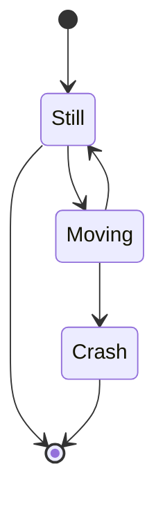

## Concepts

Modify concepts are used throughout and are defined in [reference].

## Get set up

### Sign up

Login with a GitHub or Google account and provide a unique username for your account.

A personal team will be created for your automatically, which you can invite collaborators to later on.

You'll then be directed to the Mission Control page, where you'll see some example [reference/#Workspace].

### Explore example workspaces

A workspace is a container for connectors, reviews and jobs. 

The Mission Control page comes set up with workspaces containing example content for common use cases. Click the Repository button next to the workspace name to explore.

### Set up your own workspace 

To create a new workspace, click the plus icon on the workspaces container on the Mission Control page and fill out the form.

Once created, click the Setup your workspace button, which will take you to your repository.

### Add a connector 

In your repository, click the Add connector button to a add a [reference/#Connector] to a Git repository hosted in Modify, GitHub or Bitbucket.

If you want to start exploring quickly, we recommend you choose a [reference/#Modify-hosted-connector], as you can always export your data later to GitHub or Bitbucket.

<WarningMessage header="IMPORTANT" content="You'll need accounts and Git repositories set up already to create connectors to GitHub and Bitbucket."/>

For an [reference/#External-Git-provider-connector] (GitHub and Bitbucket), you can use the OAuth-based setup flow.

First, you'll need to authenticate with your provider, install the Modify app on an organisation (GitHub) or workspace (Bitbucket) you have permissions for and (for GitHub only) configure the repositories you want to give Modify access to.

Next, you'll need to configure your connector, giving it a name and id, and selecting a remote repository and branch, then click `Add connector` to create your connector. 


Once created, your connector will appear in your repository's tree and you can view its directories and files (or artifacts, as we call them).

### Branch your workspace

For Modify connectors, you can branch your workspace at any time to work in isolation from your team. This creates branches of all connectors and their contents, and adds them to the new [reference/#Workspace-branch]`. 

For external provider connectors, you must branch your workspace before you can edit a connector's contents. 

To create a workspace branch, click the Branch workspace button in the repository's header. In the modal, select the branch you want to branch from, give your new branch a name and click the Create branch button.

Your new branch will now be selected in the breadcrumb and you can get on with collaborating on artifacts in your connectors.

## Collaborate on artifacts

The repository's editor supports real-time collaboration on any plain text [reference/#Artifact], including markdown/MDX docs and yaml registers. 

To share an artifact with someone who is already a member of your team, copy the url using the toolbar icon and send it to them.

To share an artifact with someone who is not a member of your team, click the Share button in the repository's header and send an email invite.

You can move between workspaces, workspace branches, connectors and artifacts using the breadcrumb in the header.

### Configure your layout 

You can configure your repository's layout to align with your preferences.

Use the view selector dropdown to select the view combination you want - editor or preview for markdown/MDX docs; editor, table or board for yaml registers.

### Create a markdown doc

To add a markdown [reference/#Doc], hover over a directory in your repository's tree, click the plus button, select New file and fill out the form, being sure to add an `.md` file extension.

You can now add content to your doc using [GitHub-flavoured markdown](https://github.github.com/gfm/).

<InfoMessage icon="lightbulb" header="Pro Tip" content="If your markdown is rusty, use the editor's syntax cheatsheet for a refresh and toolbar to add it to your docs"/>

### Add components with MDX

[MDX](https://mdxjs.com/) enables you to extend your markdown docs with powerful visual components.

You can use the editor's MDX cheatsheet to learn how the syntax works by clicking the syntax button in the editor's header. 

Clicking the `</>` button next to it, will launch a palette will available MDX components, where you can add MDX like this:

<ArtifactTable field="kind" exact="doc" prefix="" postfix=""/>

For contextual info on MDX syntax, you can hover over a component's name in your editor and inspect the tooltip. 

<InfoMessage icon="heart" header="What's cookin'" content="✨ We're currently working on an npm package that will allow you to use our built-in MDX and other Modify syntax in your React and Vue apps. We also plan to add to our built-in component library, as well as support third-party components so you can bring your own ✨ "/>

### Create a yaml register

To add a [reference/#Register], hover over a connector directory in your repository's tree, click the plus button, select New register and fill out the form.

You'll now see a `.modify.yaml` file in your register's directory, which contains configuration data and the schema for your register.

#### Define a schema

The quickest way to see a schema in action is to choose one of the templates provided, which you can then adapt to your own needs.

Once selected, you'll be redirected to the table view. If you inspect the `.modify.yaml` file, you'll see the schema matches the columns in the table view.

You can also use the schema editor to define or update your schema by clicking the cog button in the table view's header.

### Using different views

You can edit register source files in the editor, or with the table, board and form graphical views.

To use a graphical view, select the register directory in your tree and use the view dropdown to select the view you want. 

To use your editor, simply select the yaml files in your tree. 

Whichever view you decide to use, fields and their values are mapped between views, so they will always stay in sync.

### Upload files

You can upload files individually or in bulk by clicking the Upload files button in the repository's header.

In the modal, select a target connector and directory destination, the files you want to upload.

You can upload any files to your workspace. We provide editors for any text file format (markdown, MDX, yaml, csv, json, xml, plain text) along with live previews. 

We also provide viewers for common image formats (png, jpeg, svg) and you can download binary files for formats that don't have viewers.

MS Word documents (`*.docx`) will also be converted to markdown files automatically, to enable you to edit them and add front matter.

### Add front matter

[reference/#Front-matter] contains structured metadata that is indexed and can be used to search for and reference artifacts in your workspace using relationships and MDX elements. 

You can add it to a markdown doc or yaml register by clicking the Add front matter button in the editor or preview view headers and filling out form. 

Alternatively, you can add front matter directly to your artifact, ensuring that it is the first thing in your file and takes the form of valid yaml between triple-dashed lines e.g.

```yaml
---
id: my-id
title: My title
---
```

Currently, `id` and `title` fields are indexed automatically and searchable using the editor's artifact search.

### Define relationships

[reference/#Relationships] allow you to reference artifacts in connectors in your workspace. This can be achieved in a few ways: 

- using an artifact's `id` like so `[id-goes-here]`
- using the Link MDX component like so `<Link artifactId="..."/>`
- or by adding a relationship to front matter like so:

```yaml
---
relationships:
  - id: my-file
    direction: from | to
    kind: implements | foo | bar | baz
---
```

To search for an artifact, press CTRL + Space, search for an artifact by `id` or `title`, and add it to a file with the plus icon.

You can view a graph or table of relationships by clicking the Relationships button in the side panel on the right. 

You can then navigate between nodes in the graph or artifacts in the table using the links provided.

### Add diagrams

You can define `diagrams` using the text-based formats [mermaid](https://mermaid-js.github.io/mermaid), [graphviz](https://graphviz.org) and [nomnoml](https://nomnoml.com).

You can add example diagrams to your docs using the editor's palette.

Syntax for a simple mermaid diagram looks like:

````

````

which renders to:


Use the preview to see `diagrams` rendered on the fly and spot syntax errors.

<InfoMessage icon="lightbulb" header="Pro Tip" content="Check out the mermaid, graphviz and nomnoml websites for examples to adapt in your own diagrams."/>

### Add images 

You can upload images to your workspace using the upload feature, then using markdown syntax to reference your image file like so ``.

### Use editor shortcuts

The text editor supports keyboard shortcuts for a number of common actions. Right click anywhere in the editor and select Command palette in the context menu to see a list of available shortcuts.

### Commit changes

To [reference/#Commit-changes] to your connectors, click the commit changes button in the repository's header.

Next, add a commit message describing your change, select the files you want to commit, and click the Commit button to write them to your connector's configured Git repository.

### Inspect commit history

To inspect your commit history, hover over a file in your tree and click the history icon to show a list of all your commits.

In the modal, click on a commit ID to inspect a diff of a specific commit vs. the immediately preceding one.

### Merge changes

To merge changes from one workspace branch into another click the Merge button in the repository's header.

First, ensure you have committed your changes to the branch you want to update from, otherwise they will not be able to merge.

Next, select the target branch (defaulted to your current branch) and source branch (branch to update from). 

Finally check the diff shows the expected changes and click the Update from workspace branch button to perform the merge.

Currently, conflicts are merged as part of the update operation, and can be resolved manually with a subsequent commit. We plan to improve this in the near future.

## Review changes

### Create a review

A [reference/#Review] allows you to peer review changes on a source branch before merging them into a target branch.

To create one, navigate to the Reviews page using the left navigation bar and click the Create review button.

First select a source branch to review and a target branch to merge into. Check the diff shows the expected changes.

Next, name your review, assign a reviewer(s) and click the Create review button.

### Perform a review

In the review, review assignees can use the activity tab to write comments, the changes tab to review changes and commit additional changes, and the merge tab to merge changes from a source into a target branch.

Before you can merge, at least one reviewer must approve the changes and the automated merge checks must pass.

Automated merge checks will fail when:

- The target branch has diverged from the source branch: you must perform a branch update on your source branch before merging
- There are uncommitted changes on your source or target branches: you will need to commit these before merging
- There are merge conflicts on your source branch: you will need to resolve conflicts before merging.

Once these checks have passed, click the Merge button to fast forward merge your source into your target branch.

Once merged, the status of your review will change from `pending` to `merged`. You can now navigate to the target branch in your repository and observe the integrated changes.

## Run jobs

A [reference/#Job] allows you to trigger an external service with an HTTP request to execute a job. External services include cloud services like GitHub Actions and AWS Lamdas, as well as your own infrastructure. 

Common jobs include building and publishing artifacts in Modify to the web or document formats like PDF and MS Word.

### Define a job

To define a job, navigate to the Jobs page using the left navigation and click the Create job button.

The quickest way to get going is to use an open source example job:

- Publish a Next.js docs site to Vercel - [see instructions](https://github.com/modifyhq/nextra-vercel-example)
- Publish a Gatsby site to AWS S3 - [see instructions](https://github.com/modifyhq/gatsby-aws-example)
- Publish a Jekyll site to GitHub pages - [see instructions](https://github.com/modifyhq/jekyll-github-example)

Example jobs help you set up Modify and external services quickly, and prefill parts of Modify's job definition template.

#### GitHub Actions
For a job executed on GitHub Actions, click the GitHub Actions option. The data provided in the form will be used to construct an HTTP POST request to the GitHub REST API, triggering a `workflow_dispatch` event ([see GitHub docs](https://docs.github.com/en/free-pro-team@latest/actions/reference/events-that-trigger-workflows#workflow_dispatch)). Separately, you'll also need to define a workflow file in a Git repository defining your job. [Read here](https://docs.github.com/en/free-pro-team@latest/actions/learn-github-actions/introduction-to-github-actions#overview) for more on workflows.

#### Generic jobs

For a job executed on a general external service, click the generic job option. Here you can define the HTTP method, target URL, headers, payload and basic authentication to trigger your job.

### Run a job

Once defined, your job will appear in a list on the Jobs page. To trigger it, click the start button on the list or detail pages.

Your job will now run and marked with an `In progress` status on the detail page. Once the job completes, provided the job includes a notification to the Modify API of completion status (as with all example jobs), the status of your job will change to `Finished`. 

Click the refresh button to get the up-to-date status.

## Manage settings

### Teams

You can manage your team settings by clicking Manage teams in the breadcrumb's Team dropdown.

Click on the team's name and use the tabs to manage your workspaces, team members and connector credentials.

On the Members tab, you can send email invites to new members, and manage invites and team members.

### Workspaces

To manage a workspace, click on the workspace name on the Mission Control page.

To manage workspace branches, select Manage branches in the breadcrumb's connector dropdown.

### Connectors

To manage connectors, select the Manage connectors label in the breadcrumb's connector dropdown or navigate to the connector page using the left navigation.

You can add and remove connectors to and from your base branch only, so make sure you're on this branch first using the breadcrumb or navigation links.